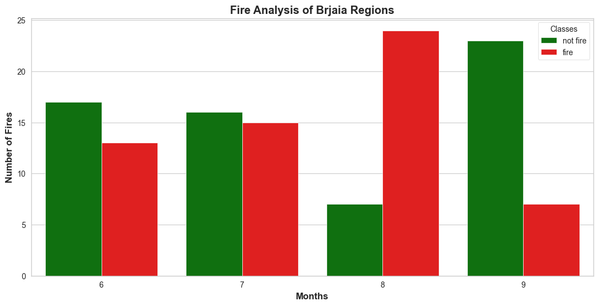
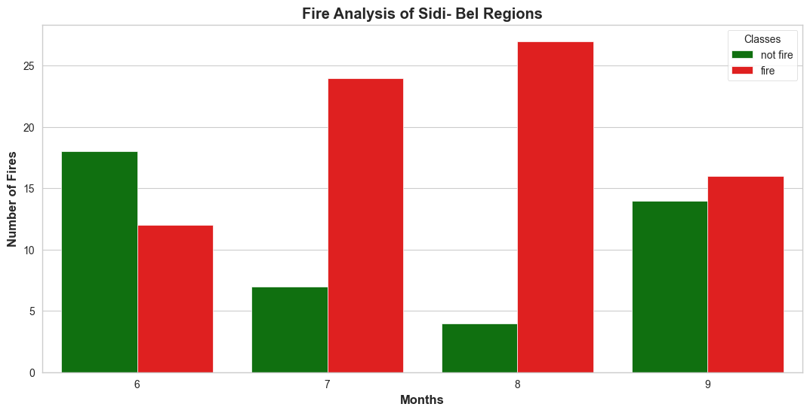

# Algerian Forest Fires — FWI Predictor

A machine learning web application that predicts the **Fire Weather Index (FWI)** for Algerian forest regions using weather and fire index features. Built with Ridge Regression, StandardScaler, and a Flask web interface.

---

## Table of Contents

- [Project Overview](#project-overview)
- [Dataset](#dataset)
- [Project Structure](#project-structure)
- [Machine Learning Pipeline](#machine-learning-pipeline)
- [Model Results](#model-results)
- [Flask Web App](#flask-web-app)
- [How to Run](#how-to-run)
- [Technologies Used](#technologies-used)

---

## Project Overview

This project uses the Algerian Forest Fires dataset to build a regression model that predicts the Fire Weather Index (FWI) — a composite score that rates fire intensity potential. The trained model and scaler are saved as pickle files and served through a Flask application where users can input weather data and receive an FWI prediction instantly.

---

## Dataset

- **Source:** Algerian Forest Fires Dataset
- **Total instances:** 244 (122 per region)
- **Regions covered:**
  - Bejaia Region (Northeast Algeria)
  - Sidi Bel-Abbes Region (Northwest Algeria)
- **Timeframe:** June 2012 – September 2012
- **Target variable:** `FWI` (Fire Weather Index, range: 0.0 – 31.1)

### Features

**Weather observations**

| Feature | Description | Range |
|---|---|---|
| Temperature | Max noon temperature (°C) | 22 – 42 |
| RH | Relative Humidity (%) | 21 – 90 |
| Ws | Wind Speed (km/h) | 6 – 29 |
| Rain | Daily rainfall (mm) | 0 – 16.8 |

**FWI system components**

| Feature | Description | Range |
|---|---|---|
| FFMC | Fine Fuel Moisture Code | 28.6 – 92.5 |
| DMC | Duff Moisture Code | 1.1 – 65.9 |
| DC | Drought Code | 7.0 – 220.4 |
| ISI | Initial Spread Index | 0.0 – 18.5 |
| BUI | Buildup Index | 1.1 – 68.0 |

**Engineered feature**

| Feature | Description |
|---|---|
| Region | 0 = Bejaia, 1 = Sidi Bel-Abbes |
| Classes | Encoded: 1 = Fire, 0 = Not Fire |

---

## Project Structure

```
FWI-prediction-with-ridge-regressor/
│
├── notebooks/                                  # Jupyter notebooks
│   ├── 2_0-EDA_And_FE_Algerian_Forest_Fires.ipynb  # EDA and feature engineering
│   └── 3_0-Model_Training.ipynb                    # Model training and evaluation
│
├── models/                                     # Saved pickle files
│   ├── scaler.pkl                              # Saved StandardScaler
│   └── ridge.pkl                               # Saved Ridge Regression model
│
├── templates/                                  # Flask HTML templates
│   └── index.html                             # Web UI for input form
│
├── .venv/                                      # Virtual environment (not committed)
├── application.py                              # Flask web application
├── requirements.txt                            # Python dependencies
└── README.md
```

---

## Machine Learning Pipeline

### 1. Data Cleaning (`2_0-EDA_And_FE_Algerian_Forest_Fires.ipynb`)

- Stripped whitespace from column names and class labels
- Fixed a formatting error at index 167 where ISI value was mixed into the DC column
- Dropped two divider rows (indices 122–123) that separated the two regional blocks
- Added a `Region` column (0 = Bejaia, 1 = Sidi Bel-Abbes)
- Converted columns to appropriate data types (int and float)
- Removed null values and duplicates
- Saved cleaned data to `Algerian_forest_fires_cleaned_dataset.csv`

### 2. Feature Engineering & EDA (`2_0-EDA_And_FE_Algerian_Forest_Fires.ipynb`)

- Encoded `Classes` column: `fire` → 1, `not fire` → 0
- Dropped `day`, `month`, `year` columns (not used in modelling)
- Plotted density plots, pie charts, and correlation heatmaps





### 3. Model Training (`3_0-Model_Training.ipynb`)

- **Train/Test split:** 75% train, 25% test (`random_state=42`)
- **Multicollinearity check:** Dropped features with correlation > 0.85 using a custom `fast_correlation()` function
- **Scaling:** Applied `StandardScaler` (fit on training data only, transformed on both sets)
- **Models evaluated:** Linear Regression, Lasso, LassoCV, Ridge, RidgeCV, ElasticNet, ElasticNetCV

### 4. Best Model — Ridge Regression

Ridge Regression gave the best results and was selected for deployment. Both the scaler and the model were saved using `pickle`:

```python
pickle.dump(scaler, open('scaler.pkl', 'wb'))
pickle.dump(ridge,  open('ridge.pkl', 'wb'))
```

---

## Model Results

| Model | MAE | R² Score |
|---|---|---|
| Linear Regression | 0.55 | 0.99 |
| Lasso | 1.18 | 0.95 |
| LassoCV | 0.59 | 0.98 |
| **Ridge** ✅ | **0.57** | **0.98** |
| RidgeCV | 0.57 | 0.98 |
| ElasticNet | 1.91 | 0.87 |
| ElasticNetCV | 0.61 | 0.98 |

> Ridge Regression was selected as the final model based on lowest MAE and highest R² score across all evaluated models.

---

## Flask Web App

The Flask application (`application.py`) loads the saved `scaler.pkl` and `ridge.pkl` files, accepts new weather feature inputs through a web form, scales them, and returns the predicted FWI value.

**Flow:**

1. User enters weather and fire index values into the web form
2. Flask receives the POST request
3. Input is scaled using the saved `StandardScaler`
4. Scaled input is passed to the saved `Ridge` model
5. Predicted FWI is displayed on the page

---

## How to Run

### Prerequisites

```bash
pip install flask scikit-learn numpy pandas
```

### Steps

```bash
# Clone or download the project
cd algerian-forest-fires

# Run the Flask app
python application.py
```

Then open your browser and go to `http://127.0.0.1:5000`.

### Input fields required

Provide values for: `Temperature`, `RH`, `Ws`, `Rain`, `FFMC`, `DMC`, `DC`, `ISI`, `BUI`, `Classes`, `Region`

The app will return the predicted **Fire Weather Index (FWI)**.

---

## Technologies Used

| Tool | Purpose |
|---|---|
| Python | Core language |
| Pandas / NumPy | Data cleaning and manipulation |
| Matplotlib / Seaborn | Visualisation |
| Scikit-learn | ML models, scaling, evaluation |
| Pickle | Model serialisation |
| Flask | Web application framework |

---

## Author

Built as a machine learning portfolio project focused on regression modelling and ML deployment with Flask.